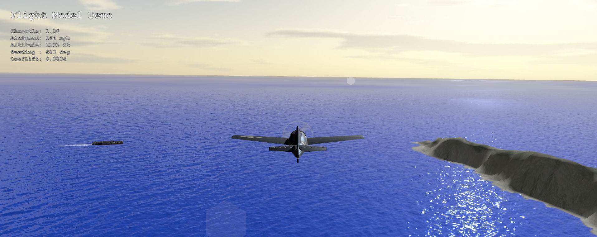

<h2>My Aviation Resources Repository (rev. 15 Jan 2025)</h2>

This repository contains aviation-related resources designed to simulate 3D flight in three.js.

This includes a flight simulation module (Flight), an iFFT ocean wave generator module (Ocean), and a fully animated WWII fighter airplane (FM2).

The repository includes several sample programs that show how to use these resources.

<ul>
	<li>The fdem programs show a basic airplane flying over the ocean and land (using the applicable modules).</li>
	<li>The fmod programs show detailed airplane models flying over an animated ocean.</li>
	<li>The fsim programs are basic flight simulation which use the flight, grid and ocean simulation modules.</li>
</ul>

You can run these programs and load these resources using the following syntax:
<pre>https://philcrowther.github.io/Aviation/file_name</pre>

For example: 
https://philcrowther.github.io/Aviation/fmod_FM2_ocean_gpu_gh.html 
https://philcrowther.github.io/Aviation/fsim_FM2_ocean_gpu_gh.html

NOTES:

The simulation and demo program use verious modules which are located in the JSM directory: these include the Flight Module, the GrdMap Module (for use with land-based programs), the Ocean Modules (an iFFT wave generator), the GrdWtr Modeul (a version of GrdMap used with ocean based programs), and the AnimFM2 Module (used to animate the FM2 model). To avoid confusion, the JSM directory now contains only the latest versions of these Modules - which work with WebGPU r172.

Special thanks to Attila Schroeder for his encouragement and assistance in converting everything to NodeMaterials and WebGPU. And to all the volunteers at three.js who took on the daunting task of modifying three.js to work with NodeMaterials and WebGPU.

